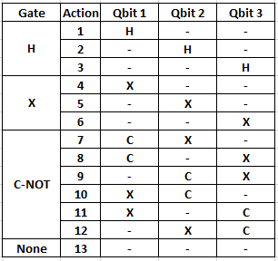
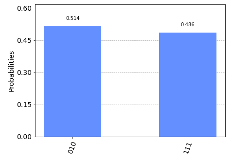

This project utilizes a Deep Q-Learning RL Architecture to teach an agent to reach a desired quantum state with 3 qbits.

Action Space: 

State Space: 
List of 8 amplitude probabilities representing distribution of outcomes for 3 qbits. 
For example, the following distribution would be represented by:
[0, 0.25, 0.25, 0, 0, 0.25, 0.25, 0] 

